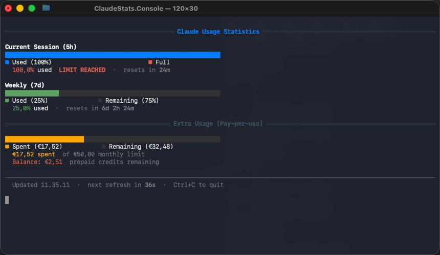

# claude-stats

A terminal dashboard that shows your [Claude.ai](https://claude.ai) usage in real time — session limits, weekly quotas, and pay-per-use spend + a count down by the to session resets.



## How it works

claude-stats uses [Playwright](https://playwright.dev) to open a headless Firefox browser with your saved session, navigate to the claude.ai usage page, and intercept the API responses — the same data your browser sees. No scraping, no unofficial API keys.

**On first run**, a Firefox window opens so you can log in normally. Your session is saved to disk and reused silently on every subsequent run — no browser window appears again unless your session expires.

## Requirements

- [.NET 10 SDK](https://dotnet.microsoft.com/download)
- macOS or Windows
- A Claude.ai account (Free, Pro, or Max)

## Installation

```bash
git clone https://github.com/tre87/claude-stats
cd claude-stats
```

### 🍎 macOS

Add an alias to your shell profile (`~/.zshrc` or `~/.bashrc`):

```bash
alias claude-stats='/path/to/claude-stats/run.sh'
```

Then reload: `source ~/.zshrc`

### 🪟 Windows

Add a function to your PowerShell profile so you can run `claude-stats` from anywhere.

Open your profile (creates it if it doesn't exist):

```powershell
notepad $PROFILE
```

Add this line, adjusting the path:

```powershell
function claude-stats { & 'C:\path\to\claude-stats\run.ps1' @args }
```

Then reload: `. $PROFILE`

The launch scripts check whether the binary is up to date with the source and rebuild automatically if needed — no manual `dotnet build` required.

## Usage

```bash
claude-stats                  # Show usage dashboard, refresh every 60s
claude-stats --interval 30    # Refresh every 30 seconds
claude-stats --login          # Clear saved session and log in again
claude-stats --discover       # Debug mode — dump all intercepted API responses
claude-stats --help           # Show all options
```

The dashboard stays open and updates every second (reset countdowns tick live). Press `Ctrl+C` to quit.

## Login & session

On first run a Firefox window opens — just log in to claude.ai as normal. Once you're logged in the window closes automatically and your session is saved to:

| Platform | Path |
|----------|------|
| macOS    | `~/Library/Application Support/claude-stats/` |
| Windows  | `%LOCALAPPDATA%\claude-stats\` |

If your session expires the window will reopen automatically. Run `claude-stats --login` to force a fresh login at any time.

## Security

- **No credentials are stored** — only the browser session cookies that claude.ai sets after login, exactly as your browser would store them.
- **No external services** — all traffic goes directly to claude.ai. Nothing is sent anywhere else.
- **Read-only** — the app only reads API responses. It never writes to or modifies your Claude account.
- **Local only** — the saved session file is only accessible to your user account.
